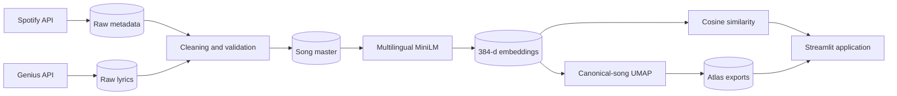
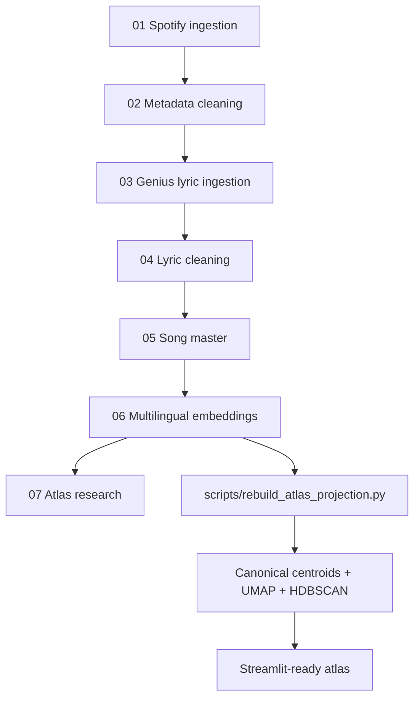

# BTS Song Atlas

> An interactive semantic universe for exploring BTS songs through multilingual lyric embeddings.

BTS Song Atlas asks a playful question: what if a discography could be explored like Google Maps? Every point is a song. Nearby points have similar lyric embeddings, and every selection reveals a new semantic neighborhood to travel through.

This is not a KPI dashboard. The map is the product.

## Why this project exists

Discographies are normally organized by album, year, or popularity. Those views are useful, but they do not reveal how songs relate through lyrical meaning. BTS Song Atlas combines Spotify metadata, Genius lyrics, transformer embeddings, cosine similarity, and UMAP to create a navigable semantic space.

Users can:

- Select a song and reveal its closest lyrical neighbors.
- Follow an evolving journey through semantic space.
- Compare two songs and see shared or unique neighborhoods.
- Search with fuzzy autocomplete and keyboard navigation.
- Move backward through release history with the Time Explorer.
- Color the same immutable layout by album, year, language, word count, or cluster.

## Application experience

### Explore mode

Selecting or jumping to a nearby song extends a visible path through the atlas. The latest song becomes the center of attention while previous stops remain connected.

### Compare mode

Two semantic neighborhoods appear simultaneously:

- Violet: the selected song's neighbors.
- Amber: the compared song's neighbors.
- Gold: neighbors shared by both songs.

The side panel reports cosine similarity, map distance, shared neighbors, albums, and release years.

### Neighborhood controls

The neighborhood size can be changed between 5, 10, 20, and 50 songs. Point strength, connection lines, labels, and the recommendation panel update together.

## Architecture



The repository keeps responsibilities separate:

```text
Research notebooks ──> Production projection script ──> Processed data
                                                        │
Data and similarity utilities ──> Plotly visualization ─┴─> Streamlit UI
```

## Data pipeline



The research remains notebook-first. The production rebuild script makes the improved canonical projection deterministic and repeatable.

## Embedding workflow

Lyrics are encoded with `sentence-transformers/paraphrase-multilingual-MiniLM-L12-v2`:

1. Keep validated exact Genius matches.
2. Clean common embed and footer artifacts.
3. Encode complete multilingual lyrics into 384-dimensional vectors.
4. L2-normalize every vector.
5. Store embeddings in Parquet for fast local loading.

Korean, English, Japanese, and mixed-language lyrics can therefore be compared in a shared vector space.

## Similarity

Recommendations use cosine similarity over the existing normalized embeddings:

```text
similarity(a, b) = (a · b) / (||a|| ||b||)
```

The application excludes the selected canonical title and keeps one preferred release per canonical song. No external model is called at runtime.

## UMAP and canonical songs

The source data contains 381 embedded Spotify releases but 194 canonical song titles. Reissues, live versions, remixes, and language editions can otherwise dominate a projection.

The production projection:

1. Groups releases by normalized canonical title.
2. Averages and normalizes embeddings within each group.
3. Fits UMAP on 194 equal-weight canonical centroids.
4. Keeps the primary version at the centroid.
5. Places alternate releases in a small deterministic orbit.

This retains every release while producing a clearer and more balanced semantic map.

## Technical stack

- Python
- Streamlit
- Plotly WebGL
- pandas and NumPy
- Sentence Transformers
- UMAP
- HDBSCAN
- Spotify Web API
- Genius API
- PyArrow / Parquet

## Repository structure

```text
.
├── app/
│   ├── Home.py                 # Streamlit entry point
│   ├── components.py           # Layout and interaction state
│   ├── visualization.py        # Plotly atlas and overview map
│   ├── utils.py                # Data, similarity, and story helpers
│   └── styles.css              # Visual system
├── data/
│   ├── raw/                    # API results
│   └── processed/              # Clean data, embeddings, atlas exports
├── notebooks/                  # 01–07 research pipeline
├── scripts/
│   └── rebuild_atlas_projection.py
├── docs/
│   ├── assets/                 # Portfolio screenshots and GIFs
│   └── reports/                # Development and audit reports
├── .streamlit/config.toml      # Deployment-safe theme and server config
└── requirements.txt
```

## Run locally

### 1. Create an environment

```bash
python -m venv .venv
source .venv/bin/activate
pip install -r requirements.txt
```

### 2. Start the application

```bash
streamlit run app/Home.py
```

The application resolves data paths relative to the repository, so it does not depend on the launch directory inside Streamlit.

To work on the full research and ingestion pipeline, install the larger notebook environment instead:

```bash
pip install -r requirements/base.txt
```

## Rebuild the atlas

The existing processed embeddings are sufficient; no API credentials are needed:

```bash
python scripts/rebuild_atlas_projection.py
```

API credentials are required only when rerunning the ingestion notebooks. Store them in an untracked `.env` file:

```dotenv
SPOTIFY_CLIENT_ID=...
SPOTIFY_CLIENT_SECRET=...
GENIUS_ACCESS_TOKEN=...
```

## Public deployment

For Streamlit Community Cloud:

1. Push the repository and processed application data to GitHub.
2. Create a new Streamlit application.
3. Set the entry point to `app/Home.py`.
4. Use Python 3.12 or another version supported by the listed packages.
5. No API secrets are required for the read-only deployed atlas.

The root requirements and `.streamlit/config.toml` are ready for this flow.

## Performance decisions

- Song points, neighbor layers, journeys, and minimaps use Plotly WebGL.
- Connection lines are combined into one trace per neighborhood.
- Embeddings and processed tables are cached by Streamlit.
- Point selection reruns only the explorer fragment.
- `uirevision` preserves map pan and zoom.
- Decorative particle fields and heavy frontend frameworks are intentionally avoided.

## Accessibility

- High-contrast text and selection borders.
- Keyboard-friendly fuzzy search.
- Labels supplement rather than replace color.
- Blue, violet, amber, and gold distinguish selection and comparison roles.
- Responsive Streamlit columns and native controls.
- Reduced visual noise at the default zoom.

## Media

Application screenshots and an Explore-mode GIF should be captured from a deployed or interactive browser session at desktop and mobile widths. Headless Chrome in the current WSL build can load the Streamlit shell but does not wait for the WebSocket-rendered application, so a blank capture is deliberately not committed as portfolio media.

Recommended assets:

```text
docs/assets/atlas-v3.png
docs/assets/compare-mode.png
docs/assets/explore-journey.gif
```

## Development reports

Detailed implementation history and validation notes are archived in [`docs/reports/`](docs/reports/). The README remains the primary project narrative; reports provide milestone-level engineering detail without cluttering the repository root.

## Lessons learned

- Release count and song count are different modeling concepts.
- Duplicate versions can distort unsupervised projections even when the model is working correctly.
- A semantic map becomes understandable only when selection changes the visual hierarchy.
- Native framework capabilities often outperform custom interaction workarounds in reliability.
- Honest rule-based descriptions are preferable to invented theme labels when topic metadata is unavailable.
- Preserving viewport state matters as much as visual polish in an exploratory interface.

## Roadmap

- Zoom-aware progressive labels through a future Plotly relayout-capable component.
- Close-zoom album artwork markers.
- Natural-language embedding search, such as “hopeful songs about youth.”
- Mood and topic metadata with human validation.
- Semantic pathfinding between two selected songs.
- Mobile-specific map controls.
- Automated data and interaction tests in CI.
- Hosted screenshots and an animated exploration demo.

## Data note

Spotify supplies release metadata and artwork URLs. Genius supplies lyric matches and source links. The application is an educational semantic exploration project and is not affiliated with BTS, HYBE, Spotify, or Genius.
